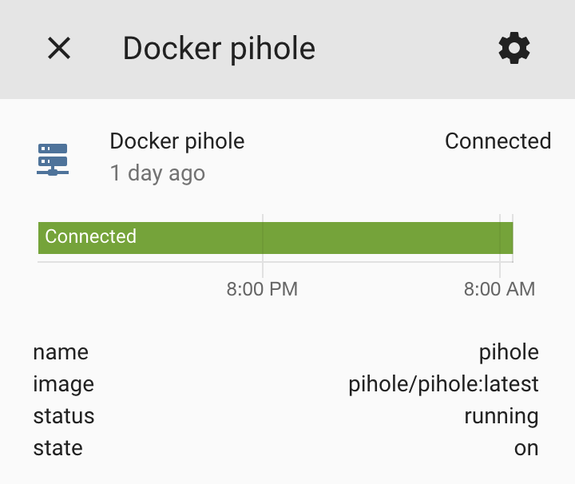

# docker2mqtt - Deliver docker status information over MQTT.

This program uses `docker events` to watch for changes in your docker containers, and delivers current status to MQTT. It will also publish Home Assistant MQTT Discovery messages so that binary sensors automatically show up in Home Assistant.

# Running

Use docker to launch this. Please note that you must give it access to your docker socket, which is typically located at `/var/run/docker.sock`. A typical invocation is:

    docker run --network mqtt -e MQTT_HOST=mosquitto -v /var/run/docker.sock:/var/run/docker.sock skullydazed/docker2mqtt

You can also use docker compose:
```yaml
version: '3'
services:
  docker2mqtt:
    container_name: docker2mqtt
    image: skullydazed/docker2mqtt
    environment:
    - DESTROYED_CONTAINER_TTL=86400
    - DOCKER2MQTT_HOSTNAME=my_docker_host
    - HOMEASSISTANT_PREFIX=homeassistant
    - MQTT_CLIENT_ID=docker2mqtt
    - MQTT_HOST=mosquitto
    - MQTT_PORT=1883
    - MQTT_USER=username
    - MQTT_PASSWD=password
    - MQTT_TIMEOUT=30
    - MQTT_TOPIC_PREFIX=docker
    - MQTT_QOS=1
    restart: always
    volumes:
    - type: volume
      source: /var/run/docker.sock
      target: /var/run/docker.sock
```

# Configuration

You can use environment variables to control the behavior.

| Variable | Default | Description |
|----------|---------|-------------|
| `DEBUG` | | Set to `1` to enable additional debug logging. |
| `DESTROYED_CONTAINER_TTL` | 86400 | How long, in seconds, before destroyed containers are removed from Home Assistant. Containers won't be removed if the service is restarted before the TTL expires. |
| `DOCKER2MQTT_HOSTNAME` | Container Hostname | The hostname of your docker host. This will be the container's hostname by default, you probably want to override it. |
| `HOMEASSISTANT_PREFIX` | `homeassistant` | The prefix for Home Assistant discovery. Must be the same as `discovery_prefix` in your Home Assistant configuration. |
| `MQTT_CLIENT_ID` | `mqtt2discord` | The client id to send to the MQTT broker. |
| `MQTT_HOST` | `localhost` | The MQTT broker to connect to. |
| `MQTT_PORT` | `1883` | The port on the broker to connect to. |
| `MQTT_USER` | `` | The user to send to the MQTT broker. Leave unset to disable authentication. |
| `MQTT_PASSWD` | `` | The password to send to the MQTT broker. Leave unset to disable authentication. |
| `MQTT_TIMEOUT` | `30` | The timeout for the MQTT connection. |
| `MQTT_TOPIC_PREFIX` | `ping` | The MQTT topic prefix. With the default data will be published to `ping/<hostname>`. |
| `MQTT_QOS` | `1` | The MQTT QOS level |

# Consuming The Data

Data is published to the topic `docker/<DOCKER2MQTT_HOSTNAME>/<container>` using JSON serialization. It will arrive whenever a change happens and takes the following form:

```yaml
{
    'name': <Container Name>,
    'image': <Container Image>,
    'status': <'paused', 'running', or 'stopped'>,
    'state': <'on' or 'off'>
}
```

# Home Assistant

After you start the service binary sensors should show up in Home Assistant immediately. Look for sensors that start with `binary_sensor.docker`. Metadata about the container will be available as attributes, which you can then expose using template sensors if you wish. 


